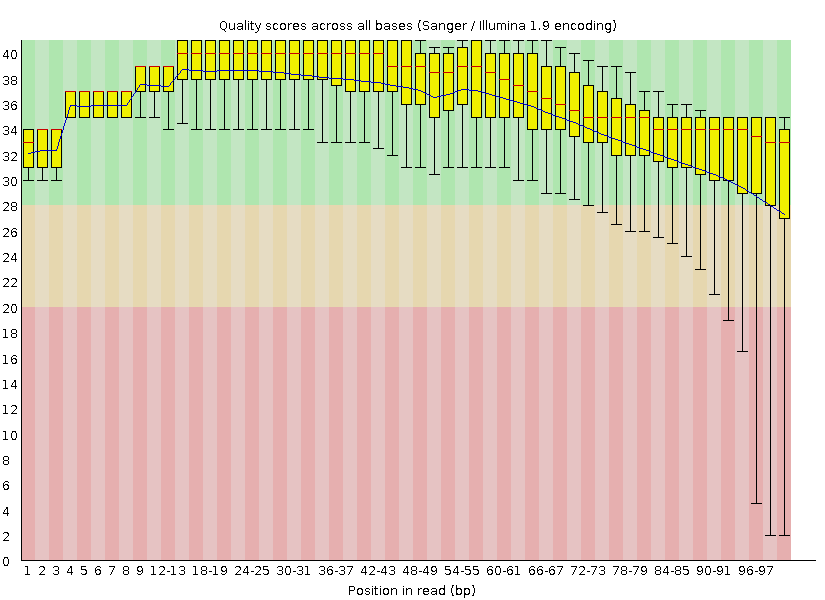
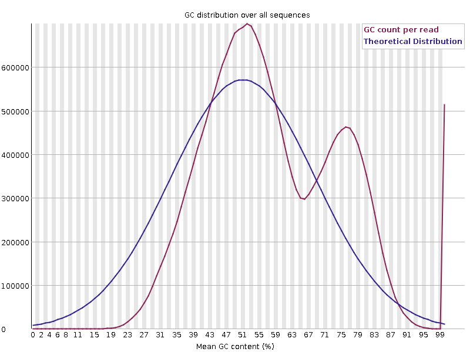

# Example RNA-sequencing Pipeline Report

Here is a short exemplar outlining how to write and structure a document about a bioinformatics pipeline for RNA-sequencing analysis.

*Comments in italics are for instruction only. They are NOT required to be in your final report*

## Summary/Overview

*Begin with a brief description of your pipeline, its main steps, inputs and what it produces*

This report describes a bioinformatics pipeline for analysing bulk RNA-sequencing from 4 samples of murine T-cells, two from black mice and two from white mice. Starting with raw FastQ files, it performs data QC and adapter trimming, aligns reads to the mouse reference genome, obtains transcript counts and verifies sample identity with a PCA plot. 

## Input Data

*List the input files used by your pipeline in this analysis. I've chosen to use a table but you may chose your own preferred format.*

| Sample Name | FastQ files |
|----------|----------| 
| BlackMouse_1 | BM1_R1.fastq.gz, BM1_R2.fastq.gz | 
| BlackMouse_2 | BM2_R1.fastq.gz, BM2_R2.fastq.gz |
| WhiteMouse_1 | WM1_R1.fastq.gz, WM1_R2.fastq.gz |
| WhiteMouse_2 | WM2_R1.fastq.gz, WM2_R2.fastq.gz |

## Implementation and Outputs

*Describe each step in your pipeline, its inputs, outputs and parameters. The intention is to make it possible for others (i.e., your lecturers) to reproduce the same results you got.*

*Numbered sub-headings will add clarity and structure to your report.

### 1. Quality Control

*Briefly describe the purpose and aim of this stage of the pipeline. Provide software used and version*

Read quality was assessed using FastQC (v0.12.1) to detect presence of possible sequence artefacts

* Describe all commands required to reproduce your output.

You must clearly indicate which elements of the report are code by using distinct code blocks. Each block should have an accompanying description. Code blocks do not count against word limit but the descriptions do.*

Create a new directory for FastQC output.

__For Bash commands, write them as you executed them:__
```bash
mkdir -p fastqc_output
``` 

FastQC was applied individually to each FastQ file.

*Describe the purpose and settings each parameter*

--outdir directs fastQC output to 'fastqc_output/'

__For bioinformatics tools, provide the command with all inputs and parameters used:__
```markdown
fastqc WM1_R1.fastq.gz --outdir=fastqc_output/
.
.
.
```

*Display and briefly comment on relevant results. Number your figures, refer to them in the text and provide brief legends*

All fastQ files had good per-base sequence as indicated by high quality scores along the full length of the reads (Figure 1) b



Figure 1: Per-base quality statistics from FastQC for reads in WM1_R1.fastq. 

However, WM1_R1.fastq showed GC bias, as indicated by deviation from expected %GC distribution across reads (Figure 2).



Figure 2: Per sequence GC content from FastQC for reads in WM1_R1.fastq. 

### 2. Adapter Trimming

### 3. Read alignment

Read alignment was performed with STAR read aligner to map reads to the Mus musculus genome assembly GRCm39.

--genomeDir sets the file path to the genome index for GRCm39
--readFilesIn specifies which FastQ files to align
--outFileNamePrefix specifies which directory to write alignment files to

*This is NOT the aligner you will be using. STAR shown for illustration purposes only.*

```markdown

Here's how to run the alignment:
# Align reads using STAR
STAR --genomeDir /home/genomeIndex/GRCm39/ \
     --readFilesIn WM1_R1.fastq.gz WM1_R2.fastq.gz \
     --outFileNamePrefix ./aligned/
```

### Add the rest of the pipeline steps

__Provide R code for steps in the analysis requiring R__
```R
library(edgeR)
transcript.counts <- read.delim("TableOfCounts.txt", row.names="Symbol")
sample.groups <- factor(c(1,1,2,2))
y <- DGEList(counts=transcript.counts,group=sample.groups)
```

***Add sections for the remaining elements of your report***

## Data Quality Assessment

## Pipeline Performance

## Summary and Next Steps
